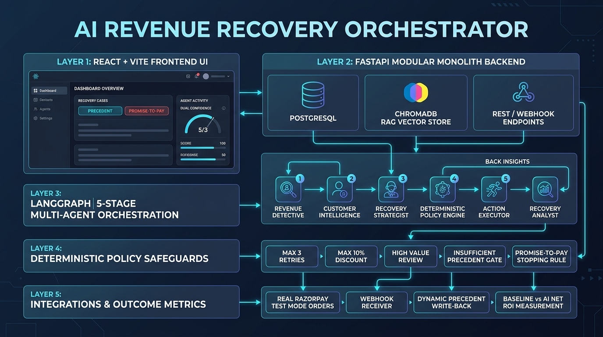

# AI Revenue Recovery Orchestrator

[](https://github.com/your-username/revenue-recovery/actions)
[](LICENSE)
[](https://www.python.org/downloads/)
[](https://vitejs.dev/)
[](https://fastapi.tiangolo.com/)

> **Razorpay AI Buildathon — Track 03: AI Revenue Recovery**

## 1. One-Line Definition

An autonomous, policy-governed AI system that detects revenue at risk from failed payments and abandoned checkouts, understands customer and payment context, selects and executes a bounded recovery strategy, and measures actual recovered revenue against a naive baseline.

> **Key Architectural Principle:** The LLM proposes decisions. A deterministic policy engine and executor control what the system is actually allowed to do. The LLM is a reasoning layer, not an authority.

---

## 2. System Architecture



```
                    ┌──────────────────┐
                    │   React + Vite   │
                    │  Tailwind/Recharts│
                    └────────┬─────────┘
                             │ REST API & Live SSE/Polling
                             ↓
                    ┌──────────────────┐
                    │   FastAPI App    │
                    │ (single service) │
                    └────────┬─────────┘
                             │
            ┌────────────────┴────────────────┐
            ↓                                 ↓
       PostgreSQL                         ChromaDB
   (Relational Domain)               (RAG Precedent Base)
            │                                 │
            └────────────────┬────────────────┘
                             ↓
                    LangGraph Orchestrator
        ┌────────────────────┼────────────────────┐
        ↓                    ↓                    ↓
  Revenue Detective   Customer Intelligence  Recovery Strategist
        └────────────────────┼────────────────────┘
                             ↓
                       Policy Engine (Deterministic Guard)
                    ┌────────┴────────┐
                    ↓                 ↓
                 APPROVE            BLOCK/ESCALATE
                    ↓                 ↓
                 Executor        Human Review Queue
        ┌───────────┼───────────┐
        ↓           ↓           ↓
     Payment     WhatsApp     Email
    Simulator   Simulator   Simulator
        └───────────┼───────────┘
                    ↓
             Promise-to-Pay Tracker (1-retry stopping rule)
                    ↓
             Recovery Analyst (Metrics & Dynamic RAG Write-Back)
                    ↓
        Baseline vs AI Benchmark Persistence (recovery_metrics)
```

---

## 3. Key Capabilities & Verified Features

- **Empirical Baseline vs AI Benchmark:** Live snapshot database persistence calculates exact ₹ recovered, recovery rates, and net ROI across customer cohorts without hardcoded numbers.
- **Compiled LangGraph Multi-Agent Pipeline:** StateGraph manages state flow across `Revenue Detective` $\to$ `Customer Intelligence` $\to$ `Recovery Strategist` $\to$ `Policy Engine` $\to$ `Action Executor` $\to$ `Recovery Analyst`.
- **RAG Recovery Playbook (ChromaDB):** Vector store precedent retrieval grounding the Recovery Strategist with dynamic write-back by Recovery Analyst and empirical Laplace-smoothed confidence score calculation.
- **Dual Confidence Telemetry:** Tracks both empirical statistical confidence (Laplace smoothing over historical cohort trials) and LLM self-stated confidence side-by-side.
- **Promise-to-Pay Tracker & Stopping Rules:** Bounded tracking for customer payment commitments with automatic follow-up and strict halting rules preventing infinite automated loops.
- **Razorpay Test API Integration & Webhook Receiver:**
  - **Tier 1 (Orders API):** Genuine Razorpay Order creation (`POST /v1/orders`) for transactions, recording authentic `order_...` IDs, with graceful offline degradation.
  - **Tier 2 (Hero Checkout & Webhook Receiver):** Real test-mode checkout flow handling test VPAs (`success@razorpay`, `failure@razorpay`) and cryptographically verified (`HMAC-SHA256`) idempotent webhook receiver (`POST /webhooks/razorpay`) with FastAPI `BackgroundTasks` for fast sub-50ms acknowledgement.
  - **Dataset Composition:** 500–1,000 calibrated, reproducible synthetic records with a small hero subset backed by live Razorpay Test API orders and authentic error taxonomy.
- **Hybrid AI Reasoning with Graceful Fallback:** Multi-provider support (Anthropic Claude, OpenAI, Google Gemini, and Mock) with automated contextual fallback.
- **Strict Deterministic Policy Engine:** Hard rules cap retry attempts ($\le 3$), enforce discount limits ($\le 10\%$), route high-value at-risk payments ($\ge ₹25,000$) to human escalation, and block ungrounded proposals via `INSUFFICIENT_PRECEDENT_GATE`.
- **Real-Time Interactive Frontend:**
  - **Dashboard:** One-click simulation triggers, 4 KPI cards, and Recharts segment comparisons.
  - **Recovery Cases:** Searchable cases table with precedent sufficiency badges, promise-to-pay status, and interactive slide-over drawer showing full 5-stage audit timelines.
  - **Agent Activity:** Auto-refreshing 3-second live audit feed highlighting policy rejections, dual confidence gauges, and retrieved precedent count ($n=X$).

---

## 4. Razorpay Test Mode vs. Calibrated Simulation

| Dimension | Live Razorpay Test Mode (Tier 1 & Tier 2) | Calibrated Simulation Dataset |
| :--- | :--- | :--- |
| **Order Creation** | Real `POST /v1/orders` API calls generating authentic `order_xxx` IDs. | Formatted authentic order identifiers for bulk cohort scale. |
| **Checkout Flow** | Test UPI VPAs (`success@razorpay`, `failure@razorpay`) with 3DS simulation. | Statistical failure distributions calibrated to Indian e-commerce benchmarks. |
| **Webhook Processing** | Idempotent `POST /webhooks/razorpay` with raw payload HMAC-SHA256 verification and `BackgroundTasks`. | In-memory simulated event triggers for batch baseline benchmarks. |
| **Error Forensics** | Authentic Razorpay fields (`error_code`, `error_source`, `error_step`, `error_reason`). | Normalized taxonomic mapping (`INSUFFICIENT_FUNDS`, `AUTHENTICATION_FAILED`, etc.). |
| **Pipeline Trigger** | Validated webhook payload directly triggers autonomous LangGraph pipeline. | Synthetically generated failure triggers the identical LangGraph pipeline. |

---

## 5. Quick Start

### Option A: Run with Docker Compose (Recommended)

1. Start all services:
   ```bash
   docker compose up -d --build
   ```

2. Open services:
   - **Frontend UI:** [http://localhost:3000](http://localhost:3000) (or [http://localhost:5173](http://localhost:5173))
   - **Backend API Docs:** [http://localhost:8000/docs](http://localhost:8000/docs)
   - **Health Endpoint:** [http://localhost:8000/health](http://localhost:8000/health)

### Option B: Local Development

1. **Backend Setup:**
   ```bash
   cd backend
   source venv/bin/activate
   pip install -r requirements.txt
   alembic upgrade head
   uvicorn app.main:app --reload --port 8000
   ```

2. **Frontend Setup:**
   ```bash
   cd frontend
   npm install
   npm run dev
   ```

---

## 6. Live Demo Guide

For a step-by-step 5-minute presentation script covering data generation, baseline comparison, AI recovery uplift, and policy engine demonstrations, refer to [docs/demo-script.md](docs/demo-script.md).

---

## 7. Verification & Test Suite

Run the full backend test suite (35 tests) and verification scripts:
```bash
# Run full unit & integration test suite (35 passing tests)
cd backend && ./venv/bin/pytest -v

# Run whole-system end-to-end trace verification
./venv/bin/python scripts/verify_phase7_system.py

# Run Tier 2 Hero Checkout & Webhook Pipeline Simulation
./venv/bin/python scripts/razorpay_checkout_flow.py

# Run Promise-to-Pay Tracker stopping rules trace
./venv/bin/python scripts/trace_promise_tracker.py
```
